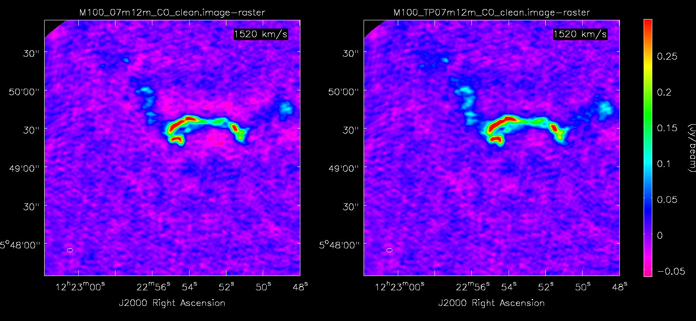

# tp2vis
Total Power to Visibilities (TP2VIS): an ALMA Development Study (2016/17)

Jin Koda, Peter Teuben, Adele Plunkett, Tsuyoshi Sawada, Crystal Brogan, Ed Formalont

This project provides tools to create visibilities from a single dish cube using the method of [Koda et al. 2011](http://adsabs.harvard.edu/abs/2011ApJS..193...19K).
The TP visibilities can then be combined with the interferometric visibilities in a joint deconvolution using for example CASA's [**tclean()**](https://casa.nrao.edu/casadocs/latest/global-task-list/task_tclean/about) method.
TP2VIS requires **CASA 5 or above** and as powerful a computer as what the CASA Feather guide requires.

Our github repo for distribution : https://github.com/tp2vis/distribute

## Release note

The current beta release is for experts with experience on interferometer data reduction with CASA. We seek feedback from the experts for improvements. It has been working science-ready for our team, and we want to know if it works for you. Release to non-experts is planned in future.

## Download

Click "Clone or download" on [top page](https://github.com/tp2vis/distribute) for download options, or run

       git clone git@github.com:tp2vis/distribute

You need only one script "tp2vis.py".

## Usage

To give you a quick idea how to run TP2VIS, here are the basic flow of commands in CASA, broken into 5 pieces. This document gives an overall flow, but look at examples listed below for more info.

### 1. Preparations:

#### 1.1: Make a pointing (**ptg**) file

       listobs('calibrated_12m.ms',listfile='calibrated_12m.log')

after which you can cut and paste the appropriate **Fields**
in the following format into a pointing file, **12m.ptg**, which has to be a simple text file:

       cat 12m.ptg
       
       J2000 05h39m45.660s -70d07m57.524s
       J2000 05h39m54.340s -70d07m57.524s
       J2000 05h39m41.320s -70d07m19.175s
       ...

This can be a little cumbersome, so in the examples listed below you can see examples using awk and grep.

#### 1.2: Find a reasonable RMS

We need to know the RMS in the TP cube from some line free channels. For example, you might be able
to use the first 10 channels of your TP cube

       imstat('tp.im',axes=[0,1])['rms'][:10].mean()
       -> 0.67

#### 1.3: Cutting down the MS dataset sizes.

Cut down unnecessary spws from measurement sets as tp2vis assumes all spws to be used for imaging.
CASA tasks such as
[**split()**](https://casa.nrao.edu/casadocs/latest/global-task-list/task_split/about)
and
[**mstransform()**](https://casa.nrao.edu/casadocs/latest/global-task-list/task_mstransform/about)
can be useful.

### 2. Load and run TP2VIS:

       execfile('tp2vis.py')                                          # load tp2vis 

       tp2vis('tp.im','tp.ms','12m.ptg',rms=0.67)                     # make visibilities

### 3. [optional] Expert mode Weighting Schemes

       tp2viswt('tp.ms', ...)                                         # set weights
       tp2vispl(['12m.ms','7m.ms','tp.ms'])                           # (optional) plot weights

"tp2viswt" shows weight statistics and manipulates weights. There are several modes how you can set weight, described in [example1](example1.md). "tp2vispl" plots the weights.

### 4. Some CASA workarounds to get files recognized properly

Currently we are suffering from CASA crashing when **tclean()** uses a list of MS files that included the TP MS, so we need to
[**concat()**](https://casa.nrao.edu/casadocs/latest/global-task-list/task_concat/about)
them.

       concat(vis=['12m.ms','7m.ms','tp.ms'], concatvis='all.ms',copypointing=False)

The "copypointing=False" option is important. No worries, important pointing info still remain in 'all.ms' (one of CASA mysteries!).

### 5. finally the joint deconvolution using CASA's ``tclean()``

       tclean(vis='all.ms', imagename='all_clean', ...)                     # run clean the way you like it

Where ... represents the large number of options to control the deconvolution. For example, users may try "robust" and "uvtaper" options.

Make dirty images as well

       tclean(vis='all.ms', imagename='all_dirty', niter=0, ...)                     # make dirty map

### (6) [optional] Correction for beam size mismatch

Once dirty and cleaned images are generated, one may correct for the discrepancy between dirty and clean/restore beam areas (see [**Jorsater and van Moorsel 1995**](http://adsabs.harvard.edu/abs/1995AJ....110.2037J)).

       tp2vistweak('all_dirty','all_clean')                   # adjust dirty beam size in residual image

It creates ``.tweak.image`` and ``.tweak.residual``, which have a correct flux scale.

## Examples

* [example1:](example1.md)  M100 (data from CASA guide on [**Feather**](https://casaguides.nrao.edu/index.php/M100_Band3_Combine_4.3))

## Comparisons of 7m+12m vs TP+7m+12m clean maps

**The spiral galaxy M100:**

Negative sidelobes around strong emissions in the 7m+12m map (left), but not in the TR+7m+12m map (right).

**A giant molecular cloud in the Large Magellanic Cloud:**

Most extended emissions are not recovered in the 7m+12m map (left), but recovered in the TR+7m+12m map (right).

## References

* Koda et al. 2011, ApJS, 193, 19 : http://adsabs.harvard.edu/abs/2011ApJS..193...19K

* CASA reference manual and cookbook : http://casa.nrao.edu/docs/cookbook/
  * Measurement Set: https://casa.nrao.edu/casadocs/latest/reference-material/measurement-set

* Jorsater and van Moorsel 1995, AJ, 110, 2037 : http://adsabs.harvard.edu/abs/1995AJ....110.2037J

## Acknowledgements

We thank Kazuki Tokuda for very helpful feedback.