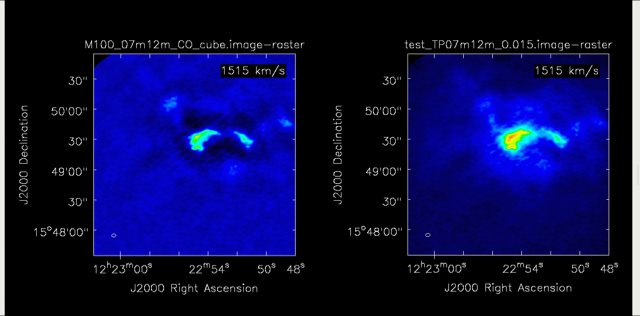
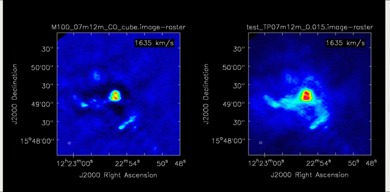

# M100

This Science Verification dataset is described at length in the
[casaguide "M100 Band3 Combine 4.3"](https://casaguides.nrao.edu/index.php/M100_Band3_Combine_4.3), were also
the CASA task **feather()** was used to combine 12m, 7m and TP data.

Here we will show how to do this with tp2vis using basic UNIX and CASA commands

## tp2vis example

Try TP2VIS with the M100 data used for Feather. The document for Feather is:
https://casaguides.nrao.edu/index.php/M100_Band3_Combine_4.3#Notes_on_the_Automasking_procedure

### (0) Download and trim ALMA 12m & 7m visibilities and TP data cube

On the UNIX command line:

    wget https://bulk.cv.nrao.edu/almadata/sciver/M100Band3_12m/M100_Band3_12m_CalibratedData.tgz
    wget https://bulk.cv.nrao.edu/almadata/sciver/M100Band3ACA/M100_Band3_7m_CalibratedData.tgz
    wget https://bulk.cv.nrao.edu/almadata/sciver/M100Band3ACA/M100_Band3_ACA_ReferenceImages.tgz

    tar xvfz M100_Band3_12m_CalibratedData.tgz
    tar xvfz M100_Band3_7m_CalibratedData.tgz
    tar xvfz M100_Band3_ACA_ReferenceImages.tgz

    mv M100_Band3_12m_CalibratedData/M100_Band3_12m_CalibratedData.ms .
    mv M100_Band3_7m_CalibratedData/M100_Band3_7m_CalibratedData.ms .
    mv M100_Band3_ACA_ReferenceImages/M100_TP_CO_cube.bl.image .

and in CASA:

    split(vis='M100_Band3_12m_CalibratedData.ms',outputvis='M100_12m_CO.ms',spw='0',field='M100',datacolumn='data',keepflags=False)
    split(vis='M100_Band3_7m_CalibratedData.ms',outputvis='M100_7m_CO.ms',spw='3,5',field='M100',datacolumn='data',keepflags=False)
    concat(vis=['M100_12m_CO.ms','M100_7m_CO.ms'],concatvis='M100_combine_CO.ms')

Make a 7m+12m dirty map for comparison later

    tclean(vis='M100_combine_CO.ms',imagename='M100_07m12m_CO_cube', niter=0,gridder='mosaic',imsize=800,cell='0.5arcsec',phasecenter='J2000 12h22m54.9 +15d49m15',weighting='natural',threshold='0mJy',specmode='cube',outframe='LSRK',restfreq='115.271201800GHz',nchan=70,start='1400km/s',width='5km/s')

    imview (raster=[{'file': 'M100_07m12m_CO_cube.image'}],zoom={'channel':23,'blc': [200,200], 'trc': [600,600]})
    imview (raster=[{'file': 'M100_07m12m_CO_cube.image'}],zoom={'channel':47,'blc': [200,200], 'trc': [600,600]})

### (1) Make a pointing (ptg) file

    listobs('M100_12m_CO.ms',listfile='12m.log')
    cat 12m.log | grep "none" | awk '{print $4,$5}' | sed 's/\([0-9]*\)\:\([0-9]*\):\([0-9.]*\) /\1h\2m\3 /' | sed 's/\([0-9][0-9]\)\.\([0-9][0-9]\)\.\([0-9][0-9]\)\./\1d\2m\3\./' | awk '{printf("J2000 %ss %ss\n",$1,$2)}' > 12.ptg

### (2) Find an RMS noise of TP data cube

Use, e.g., first 10 channels to measure RMS in this example.

    imstat('M100_TP_CO_cube.bl.image',axes=[0,1])['rms'][:10].mean()
    --> rms=0.1762048521691893

### (3) Load and run TP2VIS to generate a measurement set (MS) for TP

    execfile('tp2vis.py')
    tp2vis('M100_TP_CO_cube.bl.image','test_TP.ms','12.ptg',nvgrp=20,rms=0.1762048521691893)

### (4) Concat TP, 7m, and 12m measurement sets and run tclean to make dirty map

    concat(vis=['test_TP.ms','M100_combine_CO.ms'],concatvis='test_TP07m12m.ms')

    tclean(vis='test_TP07m12m.ms',imagename='M100_TP07m12m_CO_cube', niter=0,gridder='mosaic',imsize=800,cell='0.5arcsec',phasecenter='J2000 12h22m54.9 +15d49m15',weighting='natural',threshold='0mJy',specmode='cube',outframe='LSRK',restfreq='115.271201800GHz',nchan=70,start='1400km/s',width='5km/s')

Look at the combined dirty map.

    imview (raster=[{'file': 'M100_TP07m12m_CO_cube.image'}],zoom={'channel':23,'blc': [200,200], 'trc': [600,600]})
    imview (raster=[{'file': 'M100_TP07m12m_CO_cube.image'}],zoom={'channel':47,'blc': [200,200], 'trc': [600,600]})

It worked, but TP seems underweighted, as the combined dirty map looks the same as a 12m+7m dirty map.

If not satisfied with the combined dirty map, adjust WEIGHT in (5) and go back to (3)(4). Do this iteratively until you are satisfied.

### (5) Adjust WEIGHT

No established way to adjust WEIGHT so far. Here it is adjusted arbitrarily.

First, compare WEIGHT in TP and 12m, 7m visibilities. "mode='stat'" in tp2viswt gives some statistics of WEIGHT.

    tp2viswt('test_TP.ms',mode='stat')
    TP2VISWT: Statistics
    WEIGHT min/max:  0.0015559438616 0.0015559438616

    tp2viswt('M100_combine_CO.ms',mode='stat')
    TP2VISWT: Statistics
    WEIGHT min/max:  0.0155170047656 0.456080704927

In the combined dirty map, we didn't see much of extended emission from TP in (4). In the above statistics, the WEIGHT for TP is ~1/10 lower than that for 12m+7m, so let's try increasing the TP WEIGHT by about x10.

"mode='const'" in tp2viswt sets the WEIGHT of all visibilities to the value specified by "value=".

    tp2viswt(msTP="test_TP.ms",mode='const',value=0.015)

alternatively, "mode='multiply'" multiplies the current WEIGHT by "value=".

    tp2viswt(msTP="test_TP.ms",mode='multiply',value=10.0)

### Go back to (3)(4)

Concat and tclean

    concat(vis=['test_TP.ms','M100_combine_CO.ms'],concatvis='test_TP07m12m_WT.ms')
    tclean(vis='test_TP07m12m_WT.ms',imagename='M100_TP07m12m_WT_CO_cube', niter=0,gridder='mosaic',imsize=800,cell='0.5arcsec',phasecenter='J2000 12h22m54.9 +15d49m15',weighting='natural',threshold='0mJy',specmode='cube',outframe='LSRK',restfreq='115.271201800GHz',nchan=70,start='1400km/s',width='5km/s')

    imview (raster=[{'file': 'M100_TP07m12m_WT_CO_cube.image'}],zoom={'channel':23,'blc': [200,200], 'trc': [600,600]})
    imview (raster=[{'file': 'M100_TP07m12m_WT_CO_cube.image'}],zoom={'channel':47,'blc': [200,200], 'trc': [600,600]})

The final DIRTY map looks good.

Two channels: 12m+7m dirty maps and 12m+7m+TP dirty maps

## Acknowledgements and Data Usage

This paper makes use of the following ALMA data: ADS/JAO.ALMA#2011.0.00004.SV.
ALMA is a partnership of ESO (representing its member states), NSF (USA)
and NINS (Japan), together with NRC (Canada) and NSC and ASIAA (Taiwan),
and KASI (Republic of Korea), in cooperation with the Republic of Chile.
The Joint ALMA Observatory is operated by ESO, AUI/NRAO and NAOJ.
