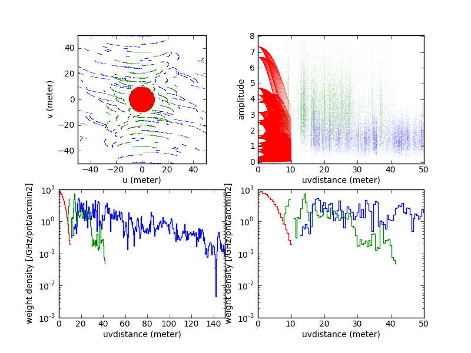

# M100

This example shows how to use TP2VIS with the M100 data. This Science Verification dataset is described at length in the [casaguide "M100 Band3 Combine 4.3"](https://casaguides.nrao.edu/index.php/M100_Band3_Combine_4.3) (or later versions), where the CASA task **feather()** was used to combine 12m, 7m and TP data.

We use basic UNIX and CASA commands. TP2VIS requires **CASA 5.4 or above** and also requires as powerful a computer as what the above CASA guide requires.

We encounter some warning/error messages from CASA, which we ignore as they seem leftovers from previous versions of CASA.

## tp2vis example

### (0) Download and trim ALMA 12m & 7m visibilities and TP data cube

On the UNIX command line:

    wget https://bulk.cv.nrao.edu/almadata/sciver/M100Band3_12m/M100_Band3_12m_CalibratedData.tgz
    wget https://bulk.cv.nrao.edu/almadata/sciver/M100Band3ACA/M100_Band3_7m_CalibratedData.tgz
    wget https://bulk.cv.nrao.edu/almadata/sciver/M100Band3ACA/M100_Band3_ACA_ReferenceImages_4.3.tgz

    tar xvfz M100_Band3_12m_CalibratedData.tgz
    tar xvfz M100_Band3_7m_CalibratedData.tgz
    tar xvfz M100_Band3_ACA_ReferenceImages_4.3.tgz

    mv M100_Band3_12m_CalibratedData/M100_Band3_12m_CalibratedData.ms .
    mv M100_Band3_7m_CalibratedData/M100_Band3_7m_CalibratedData.ms .
    mv M100_Band3_ACA_ReferenceImages/M100_TP_CO_cube.bl.image .

and in CASA:

    split(vis='M100_Band3_12m_CalibratedData.ms',outputvis='M100_12m_CO.ms',spw='0',field='M100',datacolumn='data',keepflags=False)
    split(vis='M100_Band3_7m_CalibratedData.ms',outputvis='M100_7m_CO.ms',spw='3,5',field='M100',datacolumn='data',keepflags=False)

Cut down unnecessary spws from measurement sets as tp2vis assumes all spws in MSs to be used for imaging.

Make a 7m+12m dirty and clean map for sanity check and comparison later.

    tclean(vis=['M100_12m_CO.ms','M100_7m_CO.ms'],imagename='M100_07m12m_CO_dirty', niter=0,gridder='mosaic',imsize=800,cell='0.5arcsec',phasecenter='J2000 12h22m54.9 +15d49m15',weighting='natural',threshold='0mJy',specmode='cube',outframe='LSRK',restfreq='115.271201800GHz',nchan=70,start='1400km/s',width='5km/s')

    tclean(vis=['M100_12m_CO.ms','M100_7m_CO.ms'],imagename='M100_07m12m_CO_clean', niter=10000,gridder='mosaic',imsize=800,cell='0.5arcsec',phasecenter='J2000 12h22m54.9 +15d49m15',weighting='natural',threshold='0mJy',specmode='cube',outframe='LSRK',restfreq='115.271201800GHz',nchan=70,start='1400km/s',width='5km/s')

Check the maps, e.g., with "viewer", "imview", etc.

### In what follows, we need

    tp2vis.py                     # tp2vis functions
    M100_12m_CO.ms                # 12m measurement set
    M100_7m_CO.ms                 # 7m measurement set
    M100_TP_CO_cube.bl.image      # TP data cube (assume one polarization)

### (1) Make a pointing (ptg) file

Need an ascii file with a list of pointing coordinates. You can manually type in, or take a set of pointings from 12m data:

    listobs('M100_12m_CO.ms',listfile='12m.log')
    UNIX> cat 12m.log | grep "none" | awk '{print $4,$5}' | sed 's/\([0-9]*\)\:\([0-9]*\):\([0-9.]*\) /\1h\2m\3 /' | sed 's/\([0-9][0-9]\)\.\([0-9][0-9]\)\.\([0-9][0-9]\)\./\1d\2m\3\./' | awk '{printf("J2000 %ss %ss\n",$1,$2)}' > 12.ptg

Due to CASA limitation, tp2vis currently uses 12m primary beam for mosaic, so the pointing spacing should be as dense as the one for 12m.

### (2) Find an RMS noise of TP data cube

Convert delivered FITS cube into the CASA image format with **importfits**.

Use, e.g., first 6 channels to measure RMS in this example.

    imstat('M100_TP_CO_cube.bl.image',axes=[0,1])['rms'][:6].mean()
    --> rms=0.15379972353470259

### (3) Load and run TP2VIS to generate a measurement set (MS) for TP

    execfile('tp2vis.py')
    tp2vis('M100_TP_CO_cube.bl.image','M100_TP_CO.ms','12.ptg',nvgrp=5,rms=0.15)

"nvgrp=" controls the number of visibilities generated (i.e., # of vis = 1035*nvgrp). nvgrp=5 seems enough, but users may test different values and check any difference in results.

### (*3) [Optional] Taper off emissions near the edge of TP map with the Tukey window

Skip this step for the first try. If emissions near the edge of TP map cause a problem in final map, you might suppress them with the Tukey window. It is applied before the conversion to visibilities.

    tp2vis('M100_TP_CO_cube.bl.image','M100_TP_CO.ms','12.ptg',nvgrp=5,rms=0.15, winpix=3)

This example tapers off the edge emissions within three pixels of TP map from its edge.

### (4) Run tclean to make dirty & clean maps

Run tclean to generate dirty and clean maps. For step (6), we run the same tclean with "niter=0" for dirty map.

    tclean(vis=['M100_12m_CO.ms','M100_7m_CO.ms','M100_TP_CO.ms'],imagename='M100_TP07m12m_CO_dirty', niter=0,gridder='mosaic',imsize=800,cell='0.5arcsec',phasecenter='J2000 12h22m54.9 +15d49m15',weighting='natural',threshold='0mJy',specmode='cube',outframe='LSRK',restfreq='115.271201800GHz',nchan=70,start='1400km/s',width='5km/s')

    tclean(vis=['M100_12m_CO.ms','M100_7m_CO.ms','M100_TP_CO.ms'],imagename='M100_TP07m12m_CO_clean', niter=10000,gridder='mosaic',imsize=800,cell='0.5arcsec',phasecenter='J2000 12h22m54.9 +15d49m15',weighting='natural',threshold='0mJy',specmode='cube',outframe='LSRK',restfreq='115.271201800GHz',nchan=70,start='1400km/s',width='5km/s')

Check the maps, e.g., with "viewer", "imview", etc.

In case tclean crashes (perhaps, due to inconsistensies in CASA versions used in prior data reduction), we recommend to try some of the following examples (schematic, not exact commands).  In our experience, each command works for some subset of data, but not for all.

    concat(vis=['12m','7m','TP'], concatvis='12m7mTP',copypointing=False)

    split('12m and/or 7m and/or TP', **select all data**) with/without concat

    mstransform('12m and/or 7m and/or TP', **e.g., to velocity grid of final map**) with/without concat

    or any possible combination of these tasks.

To check the effect of TP, subtract 12m+7m dirty map from 12m+7m+TP dirty map:

    immath(imagename=['M100_TP07m12m_CO_dirty.image','M100_07m12m_CO_dirty.image'],expr='IM0-IM1',outfile='difference.im')

Use "viewer", "imview", etc, to check. You should see something like the original TP map if the TP visibilities from tp2vis are properly included.

Here is a comparison of 7m+12m clean map and TP+7m+12m clean map

The negative sidelobes disappeared. If you are satisfied with this, try robust or uniform weightings in tclean to optimize images for your science.

If not satisfied with this combined 12m+7m+TP map, adjust WEIGHT in (*4) and come back to (4). Do this iteratively until you are satisfied.

### (*4) [Optional] Adjust WEIGHT

tp2vis has set the WEIGHT to an RMS-based one. If you are a first time user or are already happy with the RMS-based WEIGHT, skip this step and go to (5).

Here we show how to manipulate WEIGHT for those who want more control.

Note that historically radio interferometrists have been arbitrarily adjusting WEIGHT using, e.g., natural, uniform, or weightings robust (briggs). What's here is in the same vein.

First, compare WEIGHT in TP and 12m, 7m visibilities. "mode='stat'" in tp2viswt gives some statistics of WEIGHT.

    tp2viswt('M100_TP_CO.ms',mode='stat')
    TP2VISWT: statistics of weights
                     name spw# npnt npol     nvis   fwidth          min          max         mean          std
            M100_TP_CO.ms    0   47    1   972900   /chanw     0.002042     0.002042     0.002042     0.000000
                                                     /1GHz     1.062303     1.062303     1.062303     0.000000

The first row is statistics "per channel width", which is what is stored in MS. The second is "per 1GHz width" and is useful for comparison of multiple MSs. It takes a list of MSs as well:

    tp2viswt(['M100_7m_CO.ms','M100_12m_CO.ms'],mode='stat')
    TP2VISWT: statistics of weights
                     name spw# npnt npol     nvis   fwidth          min          max         mean          std
            M100_7m_CO.ms    1   23    2    11730   /chanw     0.023189     0.066828     0.047213     0.009826
                                                     /1GHz    47.490883   136.864090    96.691687    20.123662
            M100_7m_CO.ms    0   23    2    38052   /chanw     0.015517     0.073772     0.053025     0.011563
                                                     /1GHz    31.778826   151.085373   108.595885    23.680899
           M100_12m_CO.ms    0   47    2   138040   /chanw     0.120191     0.456081     0.294201     0.076621
                                                     /1GHz   246.150330   934.053284   602.523814   156.919250

M100_7m_CO.ms has two SPWs, so two entries.

Relative WEIGHT can be plotted:

    tp2vispl(['M100_TP_CO.ms','M100_7m_CO.ms','M100_12m_CO.ms'],outfig="plot_tp2viswt_rms.png")

Open "plot_tp2viswt_rms.png". It shows WEIGHT densities of TP (red), 7m (green), and 12m (blue). They are smoothly connected as a function of uv distance, so good.

The following may be useful if you want to change the WEIGHT, e.g., to put more emphasis on extended emission.

"mode='const'" in tp2viswt sets the WEIGHT of all visibilities to the value specified by "value=".

    tp2viswt("M100_TP_CO.ms",mode='const',value=0.015)

alternatively, "mode='multiply'" multiplies the current WEIGHT by "value=".

    tp2viswt("M100_TP_CO.ms",mode='multiply',value=10.0)

to go back to the RMS-based WEIGHT,

    tp2viswt("M100_TP_CO.ms",mode='rms',value=0.15379972353470259)

You could try a beam-size-based WEIGHT scheme.

    tp2viswt(['M100_TP_CO.ms','M100_7m_CO.ms','M100_12m_CO.ms'],mode='beam',makepsf=True)      # this takes time

Feel free to pick any WEIGHT you like. tclean() gives a correct result as it generates dirty map and dirty beam consistently with the same WEIGHT.

### Go back to (4)

### (5) Run tclean with "weighting=" and/or "robust=".

Run tclean as you like. Play around with "weighting=" and "robust=". Here, as an example, we run:

    tclean(vis='M100_TP07m12m_CO.ms',imagename='M100_TP07m12m_CO_clean',niter=10000,gridder='mosaic',imsize=800,cell='0.5arcsec',phasecenter='J2000 12h22m54.9 +15d49m15',weighting='natural',threshold='0mJy',specmode='cube',outframe='LSRK',restfreq='115.271201800GHz',nchan=70,start='1400km/s',width='5km/s')

For the next optional step, you may run the same tclean, but with "niter=0" for dirty map.

    tclean(vis='M100_TP07m12m_CO.ms',imagename='M100_TP07m12m_CO_dirty',niter=0,gridder='mosaic',imsize=800,cell='0.5arcsec',phasecenter='J2000 12h22m54.9 +15d49m15',weighting='natural',threshold='0mJy',specmode='cube',outframe='LSRK',restfreq='115.271201800GHz',nchan=70,start='1400km/s',width='5km/s')

### (6) Correction for beam size mismatch

This step is for general ALMA imaging, not only for TP2VIS.

Note that (cleaned map) = (clean component map) + (residual map). The last two maps have different units of flux densities: Jy/(clean beam) vs Jy/(dirty beam). Unfortunately, the clean beam and dirty beam are not guaranteed to have the same area, which causes a problem in flux calculation (see [Jorsater and van Moorsel 1995](http://adsabs.harvard.edu/abs/1995AJ....110.2037J); [Koda et al. 2011](http://adsabs.harvard.edu/abs/2011ApJS..193...19K)).

To circumvent this, the residual map may be scaled, so that its unit becomes Jy/(clean beam).

    tp2vistweak('M100_TP07m12m_CO_dirty','M100_TP07m12m_CO_clean',mask='M100_TP07m12m_CO_clean.image>0.2')  # need both dirty and clean image sets

tp2vistweak assumes that the "*.pb" (or "*.flux"), "*.residual", and "*.image" from tclean are kept with their original names. Include only the part of map with significant emission with "mask=" (play around with it and see the "dirty/clean" beam ratio in terminal output is stable).

It generates a re-scaled residual map ".tweak.residual", and re-calcluated cleaned map ".tweak.image". Use this cleaned map for science.

## Acknowledgements and Data Usage

This paper makes use of the following ALMA data: ADS/JAO.ALMA#2011.0.00004.SV. ALMA is a partnership of ESO (representing its member states), NSF (USA) and NINS (Japan), together with NRC (Canada) and NSC and ASIAA (Taiwan), and KASI (Republic of Korea), in cooperation with the Republic of Chile. The Joint ALMA Observatory is operated by ESO, AUI/NRAO and NAOJ.
